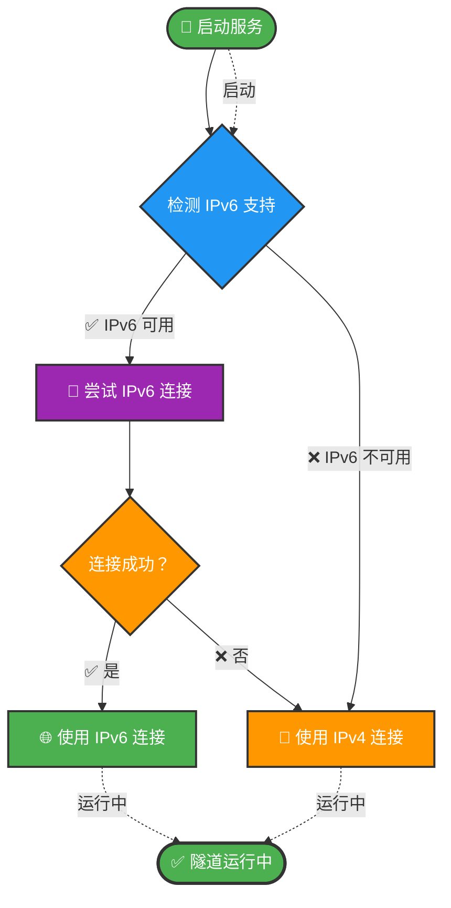

# 🌐 Cloudflare Tunnel 一键安装脚本

[](LICENSE)
[](https://www.gnu.org/software/bash/)
[](https://www.linux.org/)
[](https://github.com/Cuscito/cloudflare-tunnel-installer)

> 一键安装 Cloudflare Tunnel，支持 IPv6/IPv4 智能切换、开机自启、完整日志记录

## 📖 目录

- [✨ 功能特性](#-功能特性)
- [📋 系统要求](#-系统要求)
- [🚀 快速开始](#-快速开始)
- [📝 详细说明](#-详细说明)
- [🔧 管理命令](#-管理命令)
- [📊 运行效果](#-运行效果)
- [🔍 故障排查](#-故障排查)
- [🗑️ 卸载方法](#️-卸载方法)
- [❓ 常见问题](#-常见问题)

---

## ✨ 功能特性

| 功能 | 说明 |
|:-----|:-----|
| 🚀 **一键安装** | 自动检测系统类型并安装 cloudflared |
| 🔄 **智能切换** | IPv6 优先，失败自动切换 IPv4 |
| 📦 **开机自启** | 配置 systemd 服务，自动重启 |
| 📊 **进度显示** | 彩色输出，实时显示安装进度 |
| 📝 **完整日志** | 详细的安装和运行日志记录 |
| 🔧 **多系统支持** | Ubuntu, Debian, CentOS, RHEL, Fedora 等 |
| 🧹 **自动清理** | 检测并卸载旧服务，避免冲突 |
| 📍 **节点信息** | 显示连接的 Cloudflare 边缘节点 |

---

## 📋 系统要求

- **操作系统**: Linux (x86_64 / ARM64 / ARMv7)
- **权限**: root 或 sudo 权限
- **网络**: 能够访问 GitHub 和 Cloudflare

### 支持的系统

| 系统 | 版本 | 架构 |
|:-----|:-----|:-----|
| Ubuntu | 18.04+ | amd64, arm64, armhf |
| Debian | 10+ | amd64, arm64, armhf |
| CentOS | 7+ | amd64, arm64 |
| RHEL | 7+ | amd64, arm64 |
| Fedora | 35+ | amd64, arm64 |
| Rocky Linux | 8+ | amd64, arm64 |
| AlmaLinux | 8+ | amd64, arm64 |

---

## 🚀 快速开始

### 一键安装命令

```bash
curl -fsSL https://raw.githubusercontent.com/Cuscito/cloudflare-tunnel-installer/main/scripts/install-cloudflared.sh | sudo bash -s -- "YOUR_TOKEN"
```
## 使用示例

# 基本安装（替换为您的实际 Token）
```bash
curl -fsSL https://raw.githubusercontent.com/Cuscito/cloudflare-tunnel-installer/main/scripts/install-cloudflared.sh | sudo bash -s -- "贴换为您的TOKEN"
```

# 查看帮助
```bash
curl -fsSL https://raw.githubusercontent.com/Cuscito/cloudflare-tunnel-installer/main/scripts/install-cloudflared.sh | bash -s -- -h
```

# 卸载服务（需要先下载脚本）
```bash
wget https://raw.githubusercontent.com/Cuscito/cloudflare-tunnel-installer/main/scripts/install-cloudflared.sh
sudo bash install-cloudflared.sh --uninstall
```

## 📝 详细说明
# 安装流程
# 脚本会自动执行以下步骤：
1. 检测系统类型 (Ubuntu/Debian/CentOS/RHEL/Fedora)
2. 清理旧服务 (停止、禁用、删除配置文件)
3. 安装 cloudflared (自动选择包管理器或二进制下载)
4. 创建智能连接脚本 (IPv6 优先，失败自动切换 IPv4)
5. 创建 systemd 服务 (开机自启、自动重启)
6. 启动服务并验证状态
7. 显示连接信息和常用命令
## 智能连接逻辑
### 🔄 智能连接流程图


文件结构
安装后会在系统中创建以下文件：

文件路径	说明
/usr/local/bin/cloudflared-smart.sh	智能连接脚本
/etc/systemd/system/cloudflared.service	systemd 服务文件
/var/log/cloudflared.log	运行日志
/var/log/cloudflared-install.log	安装日志
## 🔧 管理命令
服务管理
# 查看服务状态
```bash
sudo systemctl status cloudflared
```

# 启动服务
```bash
sudo systemctl start cloudflared
```

# 停止服务
```bash
sudo systemctl stop cloudflared
```

# 重启服务
```bash
sudo systemctl restart cloudflared
```

# 查看是否开机自启
```bash
sudo systemctl is-enabled cloudflared
```
